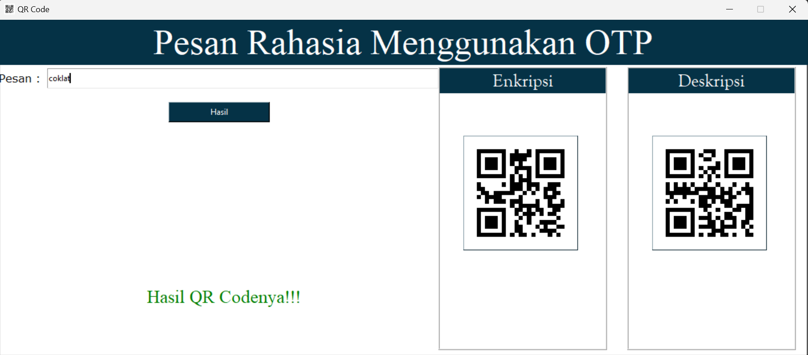

## One Time Pad QR Code Sederhana

### One-time pad (OTP) adalah teknik enkripsi yang menggunakan kunci acak yang berbeda untuk setiap sesi, sehingga sulit dipecahkan. OTP dianggap sebagai salah satu metode enkripsi yang paling aman.

### Features

1. Enkripsi 
2. Deskripsi 

### Get code.

<pre> https://github.com/bimsConnect/One-Time-Pad-QR-Code.git </pre>

### Install Required

1. <pre> pip install tk </pre>

2. <pre> pip install qrcode </pre>

3. <pre> pip install resize-image </pre>

4. <pre> pip install pad </pre>

### Thanks

If you like this code don't forget to ⭐